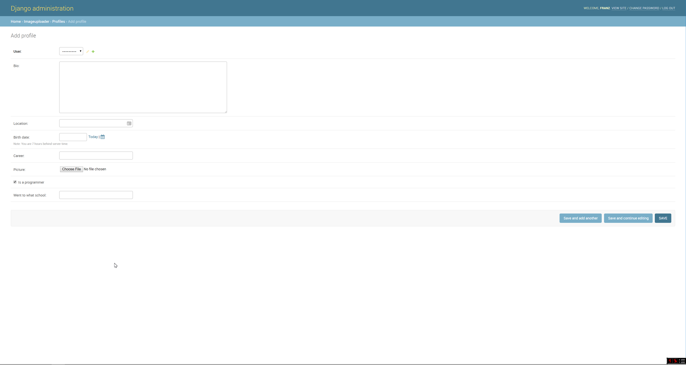

# SPRINT CHALLENGE DJANGO III  

[Heroku link](https://git.heroku.com/fathomless-harbor-73140.git)  

[Djorg repo link](https://github.com/FJF616/djorg)  

Firstly, it was very challenging building this project during this timeframe with all the other stuff going on, however, it was a very valuable experience.  To top it off, I was able to implement my own app, albeit as minimalist as it is.  It extends the user accounts by with some extra options. It also allows the user to upload a picture which I intended to be an avatar or profile picture.  Although the the functionality of loading the picture works, I wasn't able to get a thumbnail or preview to show, however I did code a method into the app, so perhaps more debugging is needed.  The other options are a short bio section, location, birthdate, career, whether or not the user is a programmer, and what school was attended.  The screen shot provided is of the admin site, however I did also code some templates that I didn't get around to implementing as well.  I do plan to work through to completion as all the steps I had originally planned are taken already.  The code consists of a class Profile model that includes decorators for the create and save functions an incomplete portion, had it been finished, calls  on the django.dispatch receiver module to display any previously saved info when a user profile is viewed. For the forms section I implemented django forms with forms.ModelForm attribute.  I believe this allows me to implement Meta data that will only show a couple of fields if a user isn't logged in. The rest is fairly similar to the other apps we did in class.  I wasn't able to expand upon those previous exercises unfortunately, however, when more time is available I will. Some of the packages that I used during this project were: crispy form, django-heroku, django-toolbelt, Pillow, request, singledispatch, imagestore, and swapper- as to how much of each I actually used, I have yet to figure that out.  I did also install nose, which I plan to use in conjunction with unit tests for more robust testing.  

